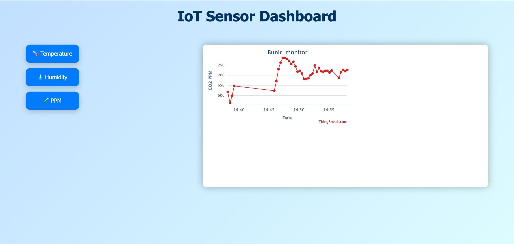
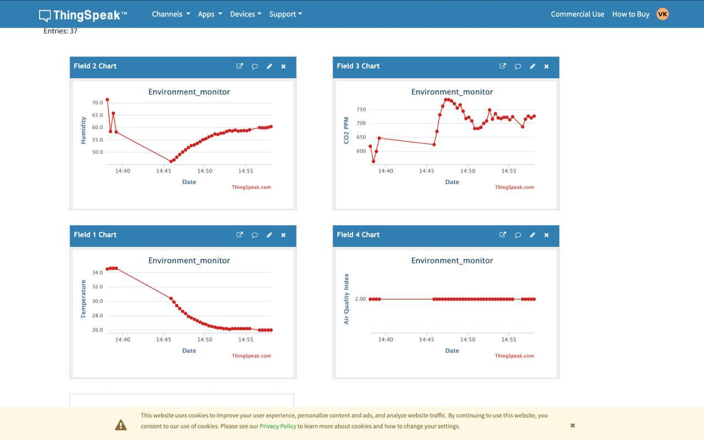

# Smart IoT Environment Monitor

A Wi-Fi enabled IoT system using ESP32 that monitors **Temperature**, **Humidity**, **CO2 (PPM)** and **Air Quality**. Data is visualized in real time using [ThingSpeak](https://thingspeak.com/).

## 🔧 Hardware
- ESP32
- DHT22 (Temperature & Humidity)
- MQ135 (CO2 & Air Quality)
- OLED SH1106 Display (I2C)
- Internet access (Wi-Fi)

## 📊 Features
- Real-time sensor data update to ThingSpeak
- On-device OLED display for live data
- Air quality calculated from PPM values

## 📷 Screenshots

### Dashboard View  


### Graph View  


## 🔗 ThingSpeak Channel
[https://thingspeak.com/channels/3011586](https://thingspeak.com/channels/3011586)

## 📁 Folder Structure

```
smart-iot-environment-monitor/
│
├── src/
│   └── iot_env_monitor.ino
│
├── images/
│   ├── dashboard.jpg
│   └── graphs.jpg
│
└── README.md
```

---

© 2025 IoT Project by Venkatkrishna D
